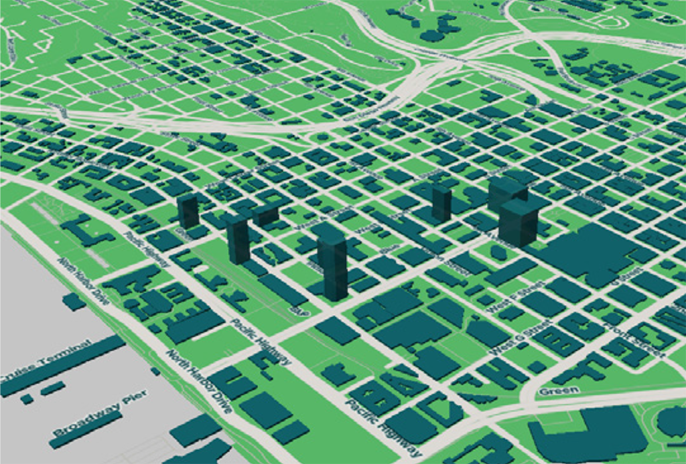
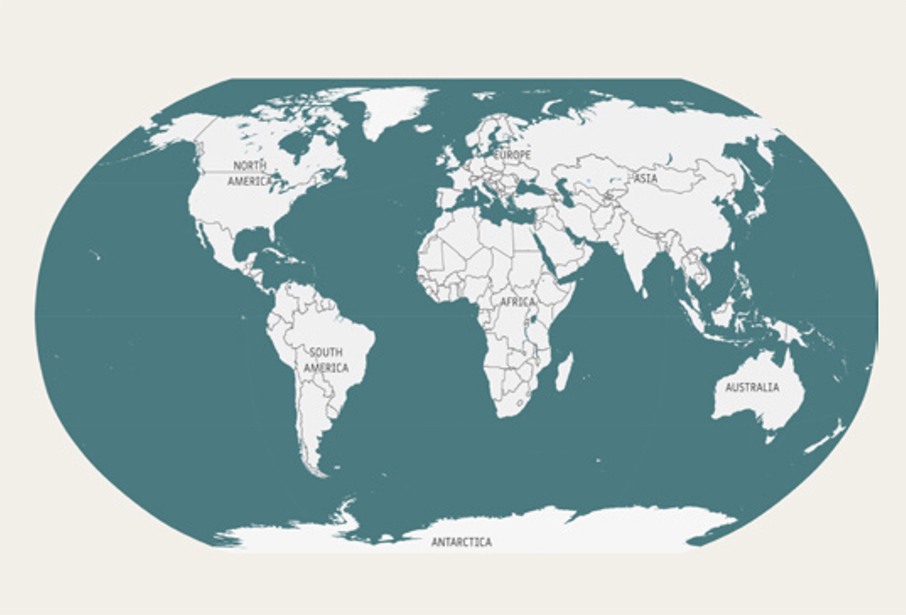
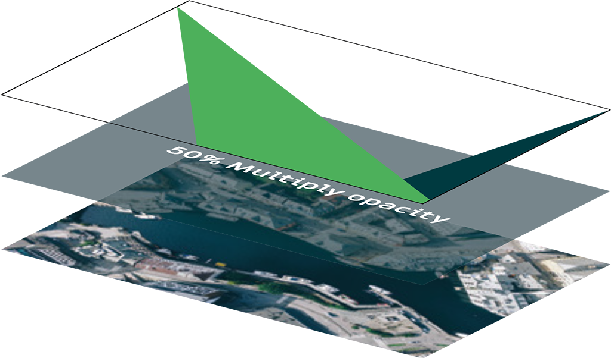
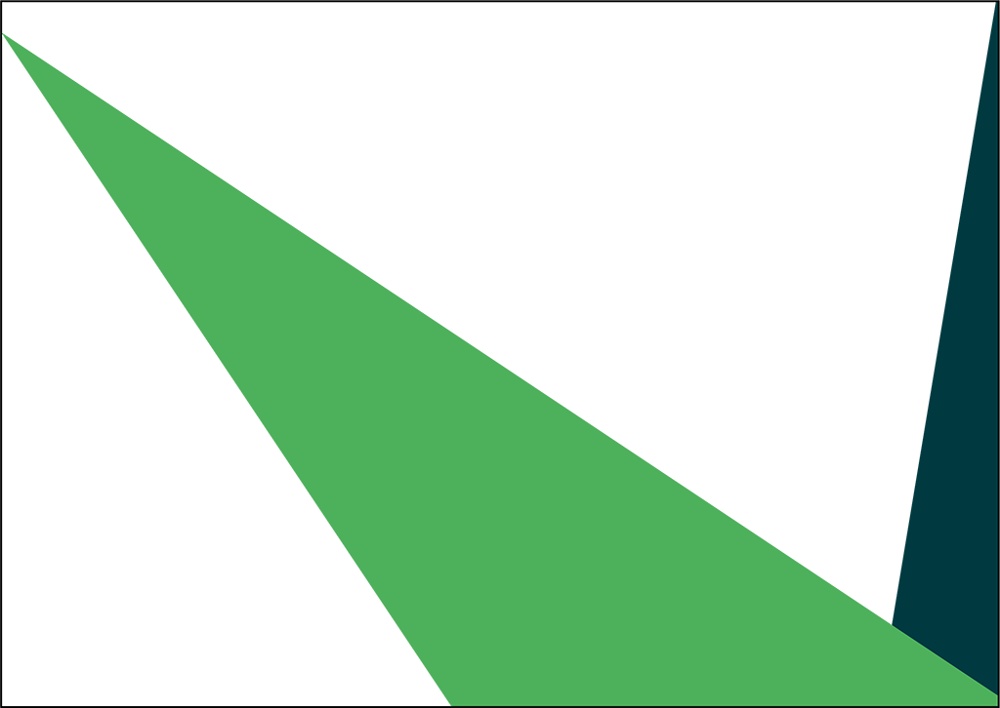

# Cartography

## Cartographic style

Cartographic style varies considerably depending on zoom level, available data or location. The OSGeo style, as applied to cartography, will vary for the same reasons. The main solution to providing a consistent look and feel within that framework is to ensure that all OSGeo styled maps use the OSGeo  [color palette](colors.md#Primary_palette).

 Features with the most visibility, area, and/ or quantity, should most often be styled with the two main colors where possible. All else being equal, #4CB05B should be the dominant color for area features, #00393F should be the second most dominant color for area features. White and the colors from the secondary palette (see Principles of colours) should be assigned for other features as shown

## Map examples

## Branding elements

Branding elements can be combined with your own photos, using the following rules:
 
<ul><li>50% Multiply Opacity with the Dark Green colour to fade out the photo (White text can be place on top)</li><li>OSGeo Green always on top</li><li>Points touching the side of the canvas</li><li>Draw compass shapes</li></ul>

