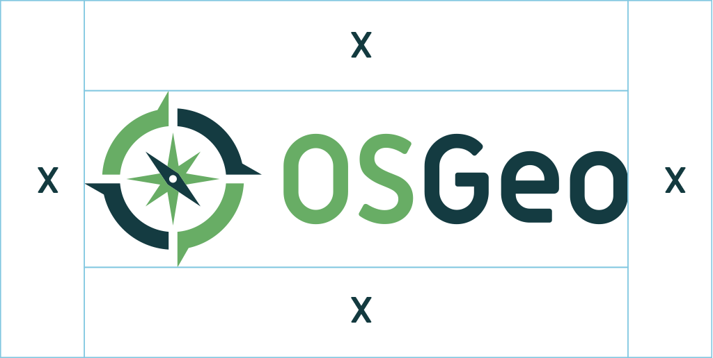
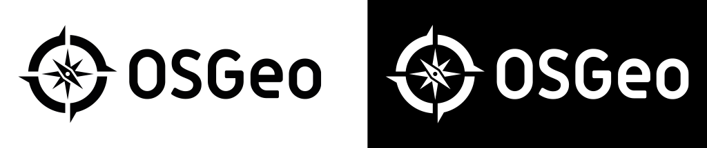
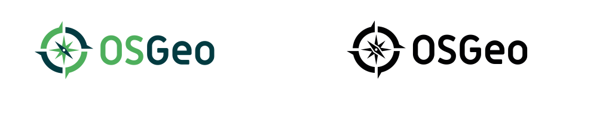
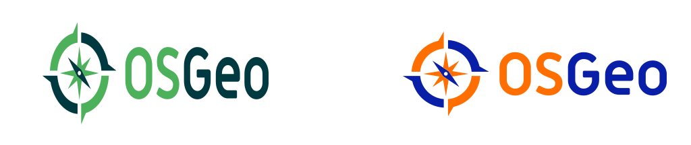
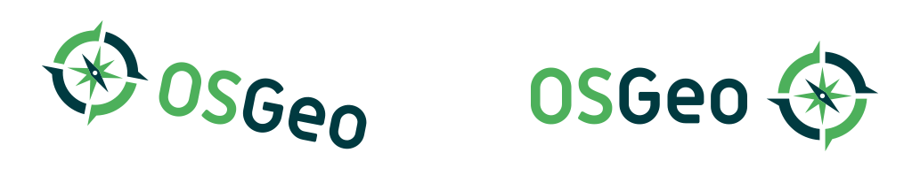
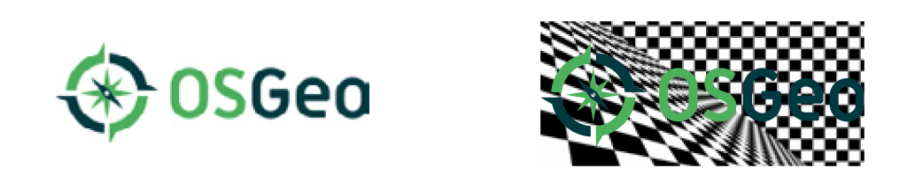
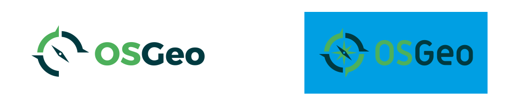

# Logotype

## Primary logo

**The OSGeo primary logo is the most important element of the Foundation brand identity.** It symbolizes our services, our products and our mission and should appear on all of our communications. The new visual treatment is designed to strengthen the identity and present a more focused positioning. The OSGeo logotype was carefully created using proportional spatial considerations. Please use the it properly and consistently throughout the materials so that it stays memorable and recognizable within our community.

### Logotype

<h4><i class="fa fa-download"></i> download logotype</h4><ul class="list-dwnld"><li><a href="https://github.com/OSGeo/osgeo/blob/master/marketing/branding/logo/osgeo-logo-rgb.png" target="_blank"><i class="ms ms-img-o"></i> PNG (RGB - 25 KB)</a></li><li><a href="https://github.com/OSGeo/osgeo/blob/master/marketing/branding/logo/osgeo-logo-cmyk.svg" target="_blank"><i class="ms ms-svg"></i> SVG (CMYK - 5.05 KB)</a></li></ul>

### Logomark

<h4><i class="fa fa-download"></i> download logomark</h4><ul class="list-dwnld"><li><a href="https://github.com/OSGeo/osgeo/blob/master/marketing/branding/logo/osgeo-emblem-rgb.png" target="_blank"><i class="ms ms-img-o"></i> PNG (RGB - 18.4 KB)</a></li><li><a href="https://github.com/OSGeo/osgeo/blob/master/marketing/branding/logo/osgeo-emblem-cmyk.svg" target="_blank"><i class="ms ms-svg"></i> SVG (CMYK - 1.3 KB)</a></li></ul>

## Acronym

OSGeo should always be written OSGeo, and the acronym should never be written <strike>OSGEO</strike> or <strike>osgeo</strike>. Please respect this simple rule in any written communication whether it be in presentation slides, website, blog post, tweet, email or any other text.

## Logo usage: Do's

* **Only use the official OSGeo logo** available for download <a href="https://github.com/OSGeo/osgeo/tree/master/marketing/branding/logo" target="_blank">here</a>.
* Make sure the Brand Assets are displayed clearly.
* Keep enough space around the Brand Assets so they appear clean and uncluttered.
* Maintain proportions and preserve clear space around the OSGeo logo.
* The OSGeo logo is always above any sub-brand name.
* If you want to direct others to OSGeo or to one of our sub-brands, feel free to display our OSGeo logo side-by-side with other logos.
* If you include the OSGeo logo next to other logos, please display it in the same size as other logos.

### Clearspace

Working with the logo requires consistent clearspace. Clearspace is the “blank” space ( X ) around the entire logo that is free of text and other graphics. The clearspace has been set according to speci c dimensions of the different logo components. 1x is the minimum amount of clearspace needed.

**Spacing of the primary logo elements should never change**. The method for spacing is measured in relative “x” units. One “x” can be determined from the height of the mark in the logotype.

### Black & white

If color is not available, use the black logo option. Use the reverse for dark backgrounds. 

### Minimum size

The minimum logotype size should be no less than 1” (25 mm) for high resolution colour applications and no less than 2” (50 mm) for high resolution black/white applications.

## Logo usage: Don't

The OSGeo logo must be presented consistently to be an effective ambassador of our organization. Please keep the following restrictions in mind when working with the OSGeo logo.

<ul><li>Do not remove the OSGeo compass mark.</li><li>Do not change, screen or decrease any of the colors within the logo.</li><li>Do not change the logo colors</li><li>Do not Rotate the logo.</li><li>Do not add any shadow to the logo.</li><li>Do not outline the logo.</li><li>Do not place the logo on similar green colors or colors of similar value.</li><li>Do not separate elements in the design.</li><li>Do not display the OSGeo logo larger than your own mark or brand.</li><li>Do not use the OSGeo logo to refer to any product or service without contacting the <a href="https://wiki.osgeo.org/wiki/Marketing_Committee" target="_blank">OSGeo Marketing Committee</a> first.</li><li>Do not feature the brand assets in connection with pornography, illegal activities, or other material violating the <a href="https://www.osgeo.org/code_of_conduct/" target="_blank">OSGeo Code of Conduct</a>.</li></ul>

