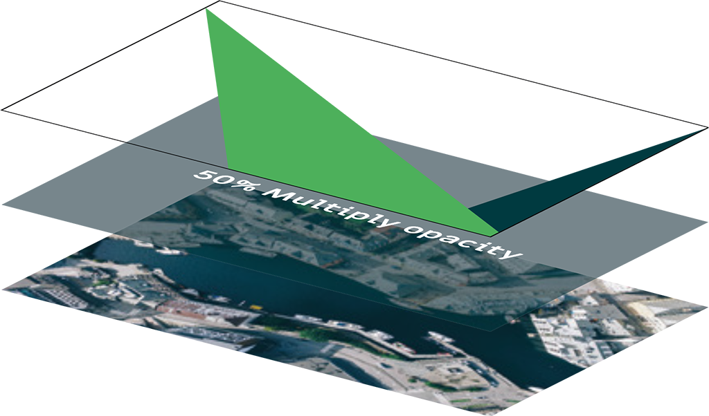

# Photography

## Photographic style

A distinctive photographic style has been developed for the OSGeo new branding. It is based on a sense of **geographical ’welcome’** and want to reflect concepts such as *explorable*, *spacious*, *topographical*, *cartographical*, *terrestrial*, *urban*, *open* and *energetic*. The use of photography should always support our brand essence and values: vibrant, living community culture, diverse, forward-thinking.

The OSGeo photographic style intends to be declinated for sub-brands, chapters or topics. It should reflect what it looks like in a specific area, and make people want to visit there.

### Urban setting

### Seaside setting

## Photo examples

## Branding elements

Branding elements can be combined with your own photos, using the following rules:
 
<ul><li>50% Multiply Opacity with the Dark Green colour to fade out the photo (White text can be place on top)</li><li>OSGeo Green always on top</li><li>Points touching the side of the canvas</li><li>Draw compass shapes</li></ul>

