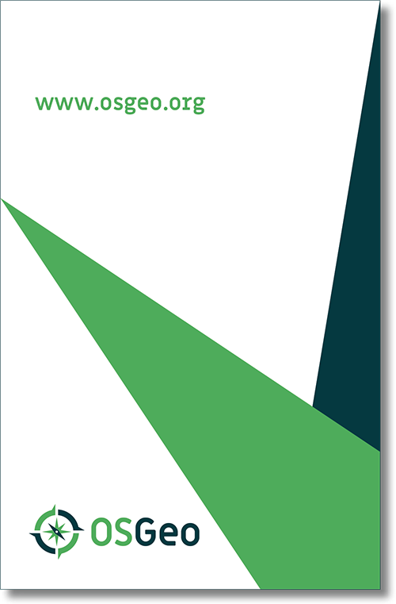

# Stationery

## Business card

<h4><i class="fa fa-download"></i> download template</h4><ul class="list-dwnld"><li><a href="https://github.com/OSGeo/osgeo/tree/master/marketing/collateral/business-card" target="_blank">For US and EU standard sizes (.eps)</a></li></ul>

## Letterhead

<h4><i class="fa fa-download"></i> download template</h4><ul class="list-dwnld"><li><a href="https://github.com/OSGeo/osgeo/tree/master/marketing/collateral/letterhead" target="_blank">For US and EU standard sizes (.eps)</a></li></ul>

## One-Page info

<h4><i class="fa fa-download"></i> download template</h4><ul class="list-dwnld"><li><a href="https://github.com/OSGeo/osgeo/tree/master/marketing/collateral/one-page-info" target="_blank">For US and EU standard sizes (.eps)</a></li></ul>

