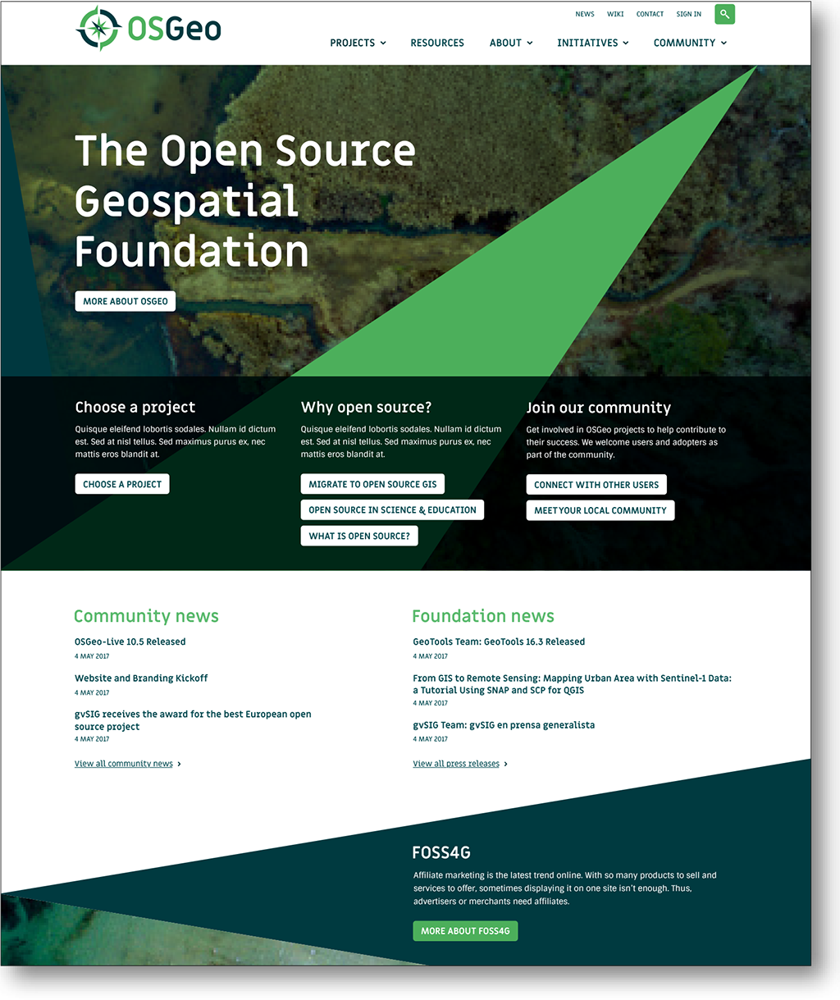
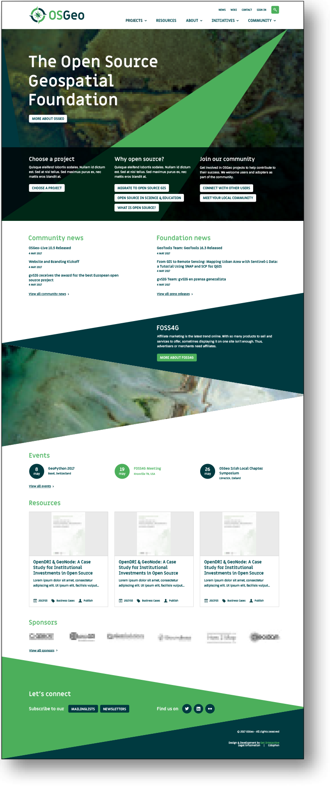
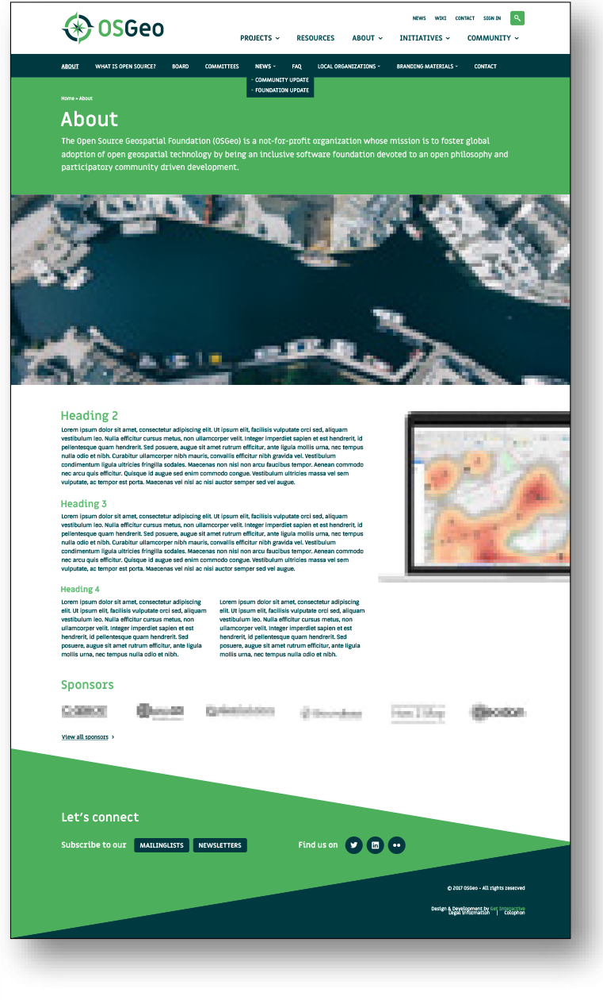
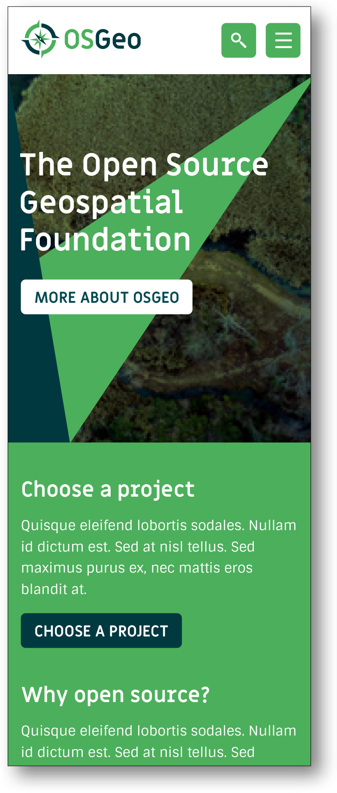
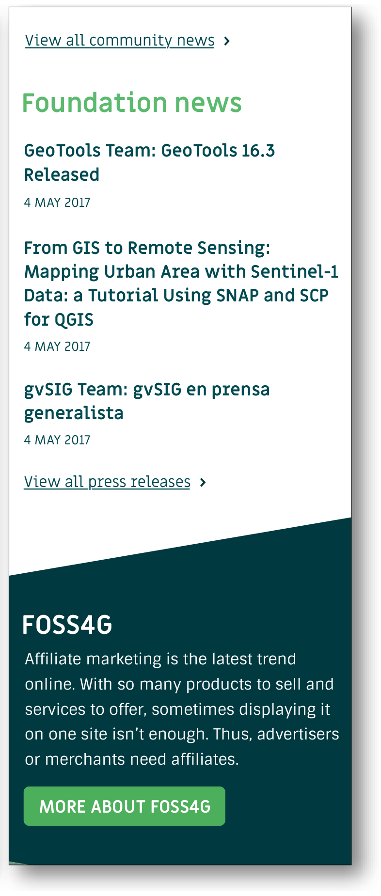
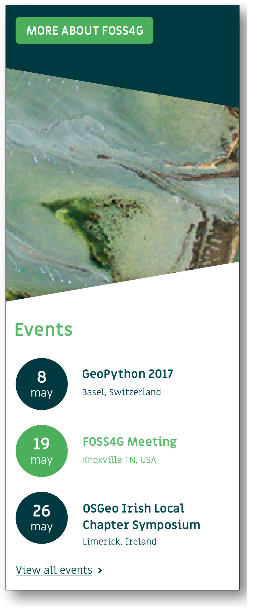

# Website

## Desktop

## Mobile

<h4>Official website </h4>

The OSGeo Foundation official website is available at <a href="https://www.osgeo.org" target="_blank">https://www.osgeo.org</a></li></ul>

